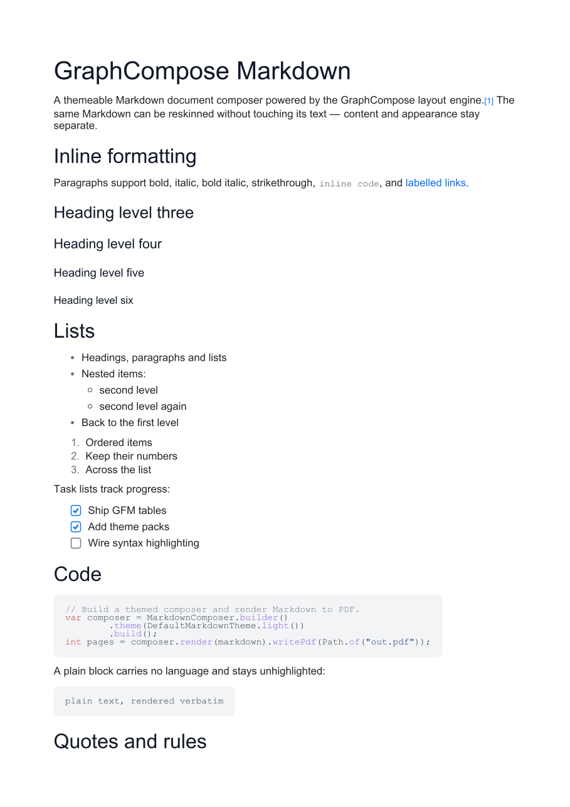
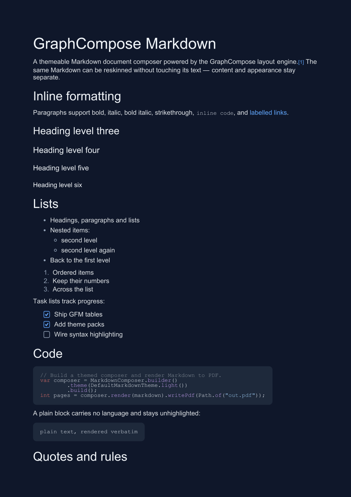
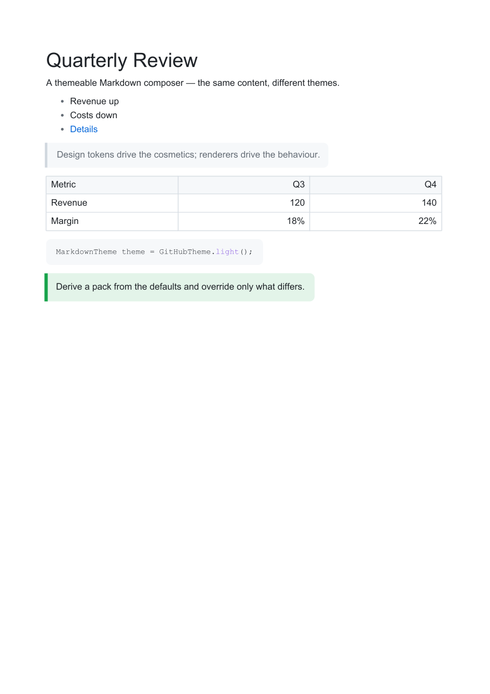
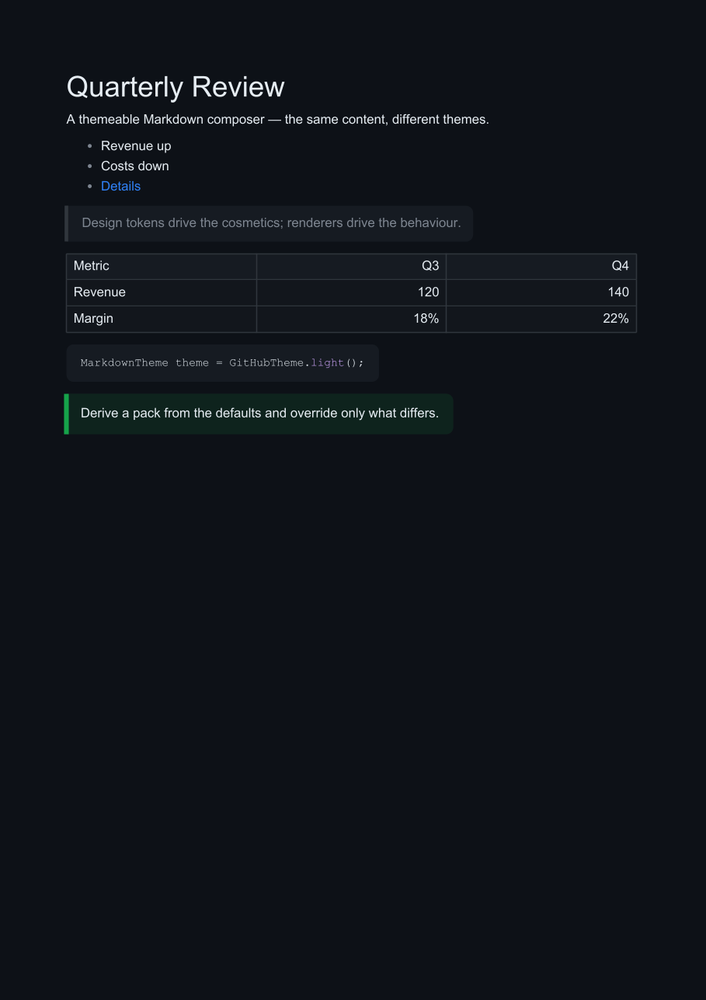
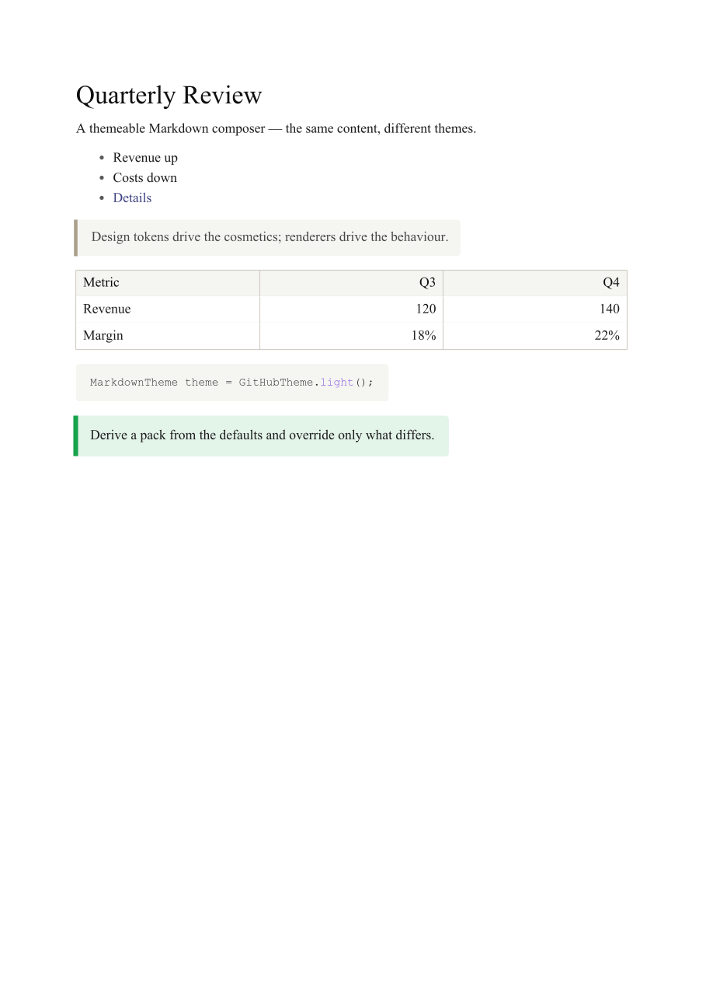
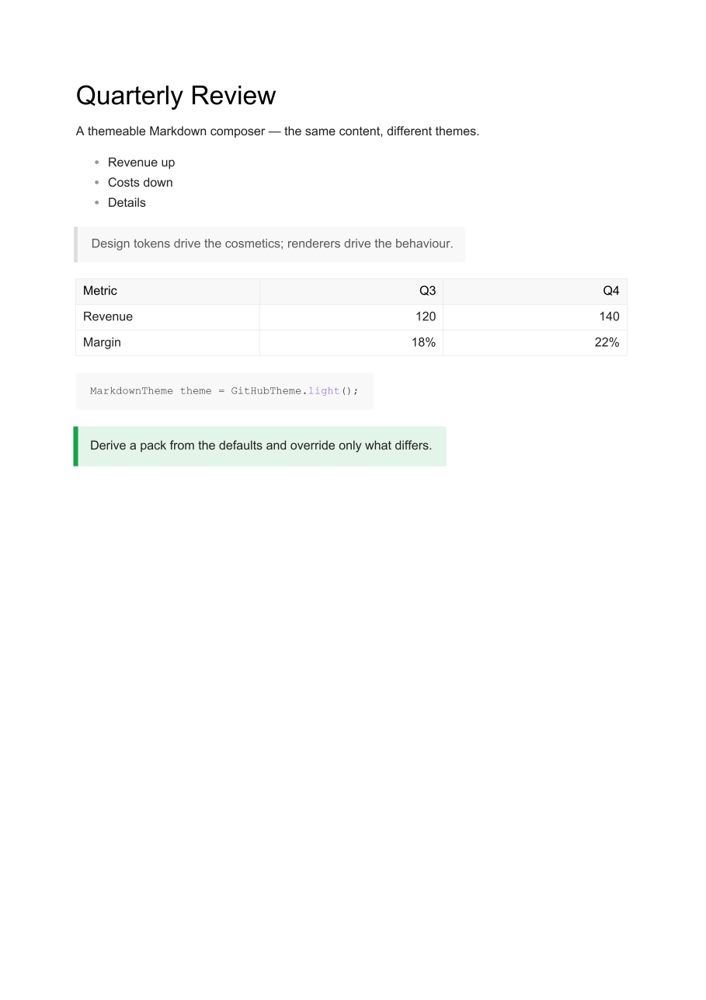
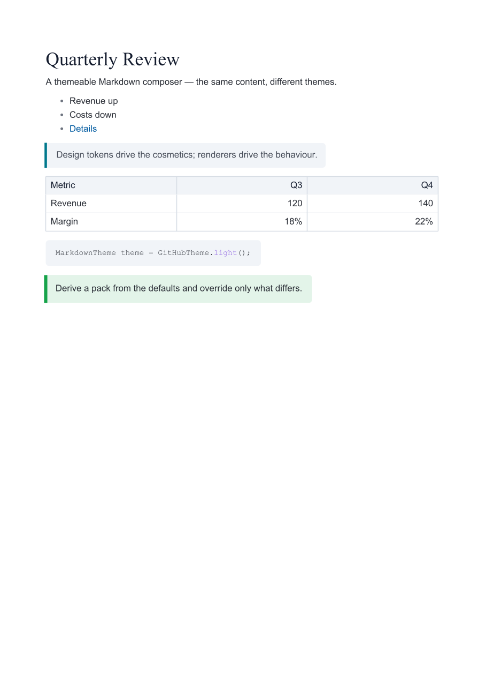
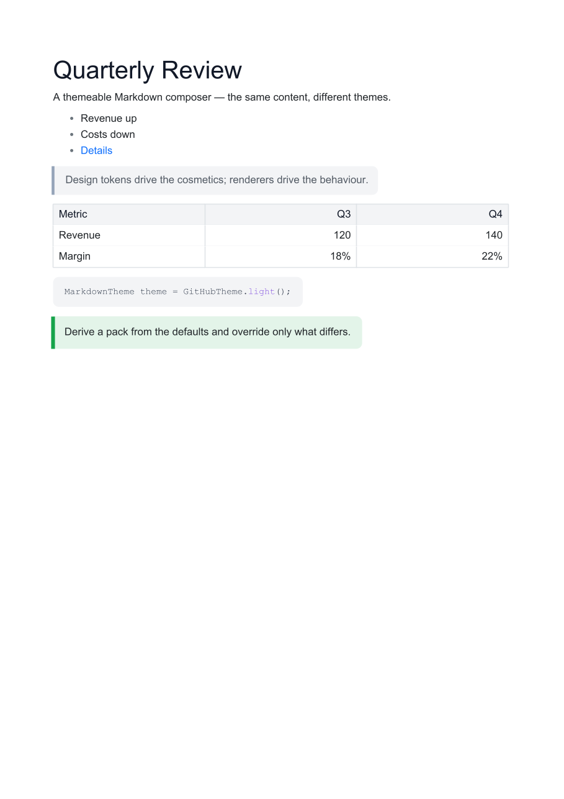
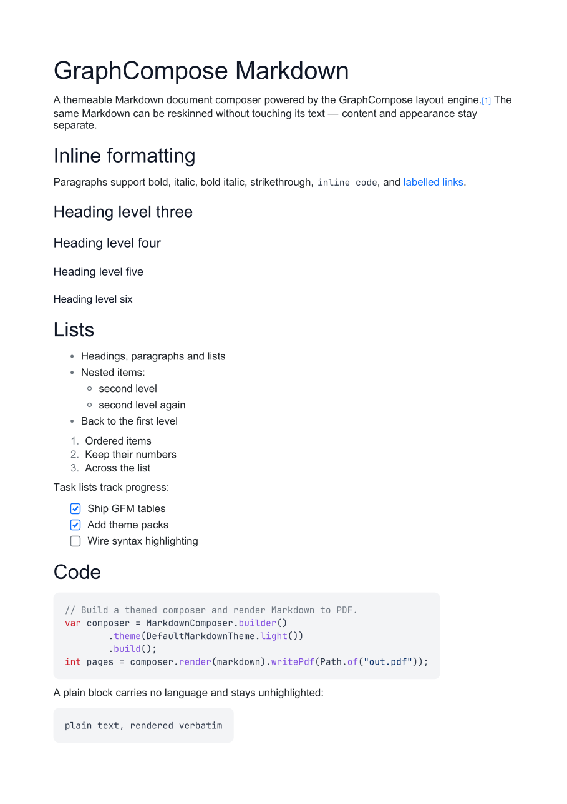

# graphcompose-markdown

**Turn Markdown into beautifully themed PDFs — parsed with [Flexmark](https://github.com/vsch/flexmark-java), laid out by the [GraphCompose](https://github.com/DemchaAV/GraphCompose) engine.**

[](https://adoptium.net/)
[](LICENSE)

graphcompose-markdown parses Markdown with **Flexmark**, maps the parse tree onto an
**independent semantic model**, and renders that model through a swappable **theme**
into the **GraphCompose** document engine — which owns measurement, layout,
pagination and PDF output.

<table>
<tr>
<td align="center"><br><sub><b>DefaultMarkdownTheme.light()</b></sub></td>
<td align="center"><br><sub><b>DefaultMarkdownTheme.dark()</b></sub></td>
</tr>
</table>

This is **not** a plain Markdown-to-PDF converter. Three concerns stay separate:

- **Content** — your Markdown text.
- **Appearance** — a theme (colors, fonts, spacing, per-element styles, renderers).
- **Layout** — GraphCompose owns measurement, pagination and output.

The same Markdown can be reskinned into completely different documents without
touching its text.

```text
Markdown ──Flexmark──▶ Flexmark AST ──mapper──▶ Semantic model ──theme + renderers──▶ GraphCompose model ──engine──▶ PDF
                                       (no Flexmark           (MarkdownNode tree)                      (layout + pagination)
                                        types downstream)
```

> Status: early preview (`0.1.0-SNAPSHOT`). The API may change before `1.0.0`.

## Why this library

- **Separation of content, appearance and layout.** Reskin a document by swapping a
  theme; the Markdown never changes.
- **Parser-decoupled semantic model.** Renderers operate on a sealed `MarkdownNode`
  tree, never on Flexmark types — so the parser stays swappable and you can build or
  transform the model by hand.
- **Three-layer theming.** Design tokens → component styles → node renderers. Override
  exactly what you need with `MarkdownTheme.builder(base)` and reuse everything else.
- **Composable renderer packs.** Ship and combine sets of renderers, override a single
  node type, or register a renderer for your own `:::` block type.
- **Built-in syntax highlighting** via a pluggable `SyntaxHighlighter` SPI (no extra
  dependency for the default).
- **Real PDF layout** — pagination, keep-together panels, GFM tables, vector list
  markers and footnotes, all from the GraphCompose engine.
- **No mandatory font artifact.** The default themes use the PDF base-14 fonts;
  JetBrains Mono is opt-in.
- **Multiple entry points.** Render a Markdown string, a pre-parsed Flexmark
  `Document`, or a hand-built semantic model.

## Install

> Not yet on Maven Central (first release pending). Until then, build from source
> (`./mvnw install`) and depend on the snapshot, or consume the repo via JitPack.

Maven (once released):

```xml
<dependency>
    <groupId>io.github.demchaav</groupId>
    <artifactId>graph-compose-markdown</artifactId>
    <version>0.1.0</version>
</dependency>
```

Requires **Java 17+**. The GraphCompose engine (`io.github.demchaav:graph-compose`)
comes in transitively.

## Quickstart

```java
import io.github.demchaav.markdown.composer.MarkdownComposer;
import io.github.demchaav.markdown.theme.DefaultMarkdownTheme;
import java.nio.file.Path;

String md = """
        # Release notes

        GraphCompose **1.8** ships *themeable* Markdown rendering.

        - Headings, lists and `inline code`
        - Syntax-highlighted code blocks
        - [Links](https://github.com/DemchaAV/GraphCompose)

        > Themes decide how all of this looks.
        """;

MarkdownComposer composer = MarkdownComposer.create(DefaultMarkdownTheme.light());

composer.render(md).writePdf(Path.of("release-notes.pdf"));
// or: byte[] pdf = composer.render(md).toPdfBytes();
//     composer.render(md).writePdf(outputStream);
```

## What renders today

Headings (h1–h6), paragraphs with inline **bold** / *italic* / ~~strikethrough~~ /
`inline code` / links, ordered & unordered (nested) lists, **task lists**,
**syntax-highlighted** fenced code blocks, blockquotes, horizontal rules, images,
**GFM tables** (with per-column alignment), **footnotes**, and `:::` custom blocks
(e.g. callouts).

## Architecture

```text
MarkdownComposer.render(String)
   │  Flexmark parser (+ GFM tables, task lists, strikethrough, footnotes)
   ▼
Flexmark AST
   │  FlexmarkAstMapper  — the boundary: nothing downstream imports Flexmark
   ▼
MarkdownDocument  (sealed MarkdownNode tree: HeadingNode, ParagraphNode, ListNode,
   │               CodeBlockNode, QuoteNode, TableNode, CustomBlockNode, …)
   │  RendererRegistry  — one NodeRenderer per node type, from the theme
   ▼
GraphCompose document model  (sections, paragraphs, RichText, tables, panels)
   │  GraphCompose engine
   ▼
Layout + pagination → PDF
```

The semantic model is the stable hand-off point: the parser is swappable, renderers
never see Flexmark, and you can construct or transform the model directly. See
**[docs/architecture.md](docs/architecture.md)** for the full picture.

## Theming

A `MarkdownTheme` is built from three layers, so you change exactly as much as you
need and reuse everything else:

1. **Design tokens** (`MarkdownTokens`) — cosmetic values: colors, fonts, sizes,
   spacing, borders, corner radii, page geometry, syntax-highlight colors.
2. **Component styles** (`MarkdownStyles`) — per-element styles (`HeadingStyle`,
   `CodeBlockStyle`, `ListStyle`, `QuoteStyle`, …) derived from tokens.
3. **Node renderers** (`NodeRenderer`) — the behaviour that turns each semantic node
   into GraphCompose builders, bound to node types in a `RendererRegistry`.

```java
MarkdownTheme base = DefaultMarkdownTheme.light();

MarkdownTheme custom = MarkdownTheme.builder(base)
        // layer 1 — reskin a cosmetic token
        .tokens(base.tokens().withColors(
                base.tokens().colors().withCodeBackground(DocumentColor.rgb(246, 248, 250))))
        // layer 3 — swap one renderer, reuse every other component
        .renderer(CodeBlockNode.class, new LabeledCodeBlockRenderer())
        .build();
```

### Ready-made theme packs

Beyond `DefaultMarkdownTheme.light()` / `.dark()`, the
`io.github.demchaav.markdown.theme.packs` package ships drop-in themes — the same
Markdown, reskinned:

<table>
<tr>
<td align="center"><br><sub><code>GitHubTheme.light()</code></sub></td>
<td align="center"><br><sub><code>GitHubTheme.dark()</code></sub></td>
<td align="center"><br><sub><code>AcademicTheme.light()</code></sub></td>
</tr>
<tr>
<td align="center"><br><sub><code>MinimalTheme.light()</code></sub></td>
<td align="center"><br><sub><code>BusinessReportTheme.light()</code></sub></td>
<td align="center"><br><sub><code>DefaultMarkdownTheme.light()</code></sub></td>
</tr>
</table>

```java
MarkdownComposer.create(GitHubTheme.dark()).render(md).writePdf(path);
```

Full theming guide: **[docs/theming.md](docs/theming.md)**.

## Custom renderers — change *how* Markdown renders

A `NodeRenderer` is a single method that turns one semantic node into GraphCompose
builders, reading all styling from the `RenderContext`:

```java
NodeRenderer<CodeBlockNode> labeled = (node, host, ctx) -> {
    // emit GraphCompose builders into `host`; read styling from `ctx`
    host.addParagraph(p -> p.text(node.language().toUpperCase()));
    // ...render the code body using ctx.styles(), ctx.highlighter(), …
};
```

Bundle renderers into a **pack**, override a single node type, or register a renderer
for your own `:::` block — reusing everything else:

```java
MarkdownTheme theme = MarkdownTheme.builder(DefaultMarkdownTheme.light())
        .pack(new MyAlertsPack())                   // bundle renderers from another source
        .renderer(CodeBlockNode.class, labeled)     // override one node renderer
        .customBlock("chart", new ChartRenderer())  // render your own ::: block type
        .build();
```

A `:::chart … :::` block routes to the renderer registered for `"chart"`; any
unrecognised `:::` type falls back to the callout style. Step-by-step guide (with a
full custom `RendererPack`): **[docs/custom-renderers.md](docs/custom-renderers.md)**.

### Syntax highlighting

Code highlighting uses a pluggable `SyntaxHighlighter` SPI. The built-in
`RegexSyntaxHighlighter` covers ~15 common languages with no extra dependency; plug a
grammar-based highlighter via `MarkdownTheme.builder().highlighter(...)`. Colors come
from the theme's `SyntaxColors` token group (light/dark palettes).

### Rich fonts (optional)

The default themes use the PDF **base-14** fonts (Helvetica / Times / Courier). To
render code in **JetBrains Mono**, add the bundled-fonts artifact and upgrade any
theme with `BundledFonts`:

```xml
<dependency>
    <groupId>io.github.demchaav</groupId>
    <artifactId>graph-compose-fonts</artifactId>
    <version>1.0.0</version>
</dependency>
```

```java
MarkdownTheme theme = BundledFonts.jetBrainsMonoCode(DefaultMarkdownTheme.light());
```

<p align="center"></p>

The dependency is declared `optional`, so it only ships if you ask for it.

## Bring your own AST

Already have a Flexmark tree (parsed with your own parser and extensions), or build
the semantic model yourself? Render either directly — no string round-trip, no file:

```java
// a com.vladsch.flexmark.util.ast.Document you already parsed
composer.render(flexmarkDocument).toPdfBytes();

// or a hand-built / transformed MarkdownDocument semantic model
composer.render(markdownDocument).writePdf(out);
```

(The `:::` custom-block extraction is a text-level pre-pass, so it only runs for the
`render(String)` entry point.)

## Documentation

- **[Architecture](docs/architecture.md)** — the pipeline, the semantic model, and why
  the parser is decoupled.
- **[Theming](docs/theming.md)** — tokens, component styles, deriving themes, packs,
  syntax colors, rich fonts.
- **[Custom renderers](docs/custom-renderers.md)** — write a `NodeRenderer`, a
  `RendererPack`, and custom `:::` block types.
- **[Changelog](CHANGELOG.md)** — release notes.

## Building from source

```bash
./mvnw -B -ntp clean verify          # compile + run the full test suite
./mvnw -B -ntp clean verify javadoc:javadoc   # + Javadoc gate
```

See **[CONTRIBUTING.md](CONTRIBUTING.md)** for the branch workflow and commit style.

## License

[MIT](LICENSE) © Artem Demchyshyn
